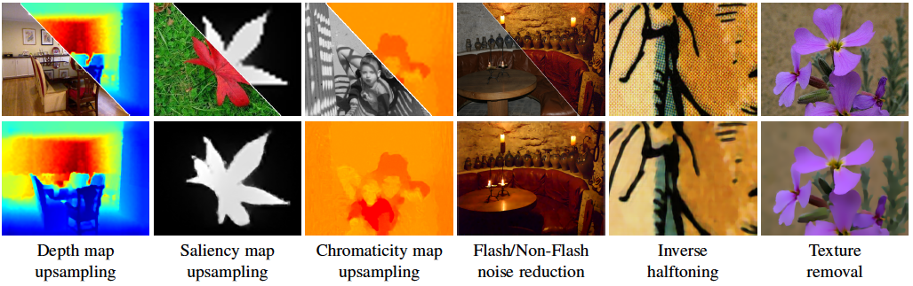

# [Deep Joint Image Filtering](https://sites.google.com/site/yijunlimaverick/deepjointfilter)

MatConvNet implementation of our ECCV16 [paper](https://drive.google.com/file/d/0B8_MZ8a8aoSeSVZRNVB1TkYtbFU/view) on joint image filtering. For academic use only. 



## Prerequisites

- Tested on Linux or Windows
- Matlab R2015b
- [MatConvNet](http://www.vlfeat.org/matconvnet)

```
> matlab/vl_setupnn.m
> matlab/vl_compilenn.m
```


## Training:

Generate the training data (nearly the same way used in [SRCNN](http://mmlab.ie.cuhk.edu.hk/projects/SRCNN.html)).

```
> examples/Train/generate_trainingdata.m
```

Or please download the training [data](https://drive.google.com/open?id=0B8_MZ8a8aoSeMm42TTJzc25MSGM) (for 8x depth upsampling) and put it under the examples/Train/TrainingData/ folder.


```
> examples/Train/demo_train.m
```

## Testing:

We provide our models for two tasks, i.e., depth map upsampling and Flash/Non-flash image noise reduction.

```
> examples/Test/cnn_test_upsampling.m
> examples/Test/cnn_test_noise_reduction.m
```

## Note

For training with GPU, please uncomment line 215-217 and 222-223 in matlab/simplenn.m and then re-compile.

```
> vl_setupnn.m
> vl_compilenn('enableGpu', true)
```

## Citation

```
@inproceedings{DJF-ECCV-2016,
    author = {Li, Yijun and Huang, Jia-Bin and Ahuja Narendra and Yang, Ming-Hsuan},
    title = {Deep Joint Image Filtering},
    booktitle = {European Conference on Computer Vision},
    year = {2016}
}
```

## Acknowledgement

We express gratitudes to [SRCNN](http://mmlab.ie.cuhk.edu.hk/projects/SRCNN.html) as we benefit a lot from both their paper and codes.
